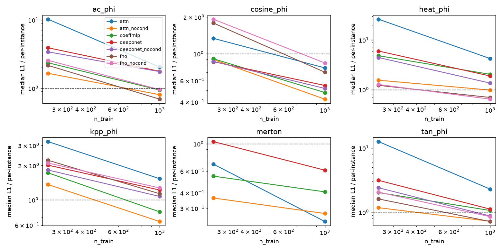

# Universal-backbone benchmark — results

Run on 16–17 September 2026 on branch `research/nn-backbone-benchmark`
(spec: [`2026-09-16-backbone-benchmark-design.md`](../../superpowers/specs/2026-09-16-backbone-benchmark-design.md),
plan: [`2026-09-16-backbone-benchmark-plan.md`](../../superpowers/plans/2026-09-16-backbone-benchmark-plan.md)).
Ledger: `examples/backbone_benchmark.csv`; pre-check outcomes:
`examples/backbone_benchmark_precheck.json`; rerun / re-report with
`examples/backbone_benchmark.py` (`--precheck`, per-family runs, `--report --figure`).
Hardware: RTX 4060 laptop, torch 2.11+cu128, 16 worker processes for the sampler.

## Question and rule (fixed before the run)

Same four backbones, same corpus protocol, same metric, over the broadest
set of 1-D nonlinear PDEs whose coding-tree labels pass a calibration
pre-check; pick the backbone with the best **overall** score, then tune it
(next spec). Protocol per family: 1000 training / 50 held-out instances,
500 states, M = 1000, one draw; backbones trained at n_train ∈ {250, 1000},
20 000 steps, one seed; per-instance R5A net as the baseline.

- \(r_{f,b}\) = median held-out grid L1 / baseline median at n = 1000.
- \(S_b\) = geometric mean of \(r_{f,b}\) over families; **winner** = lowest \(S_b\).
- **Failure family**: \(r_{f,b} > 1.5\). **Robustness winner**: lowest \(\max_f r_{f,b}\).
- Learning-curve slope \(\log(S_{250}/S_{1000})\) reported, not scored.

## Calibration pre-check (20 instances, M = 1000 vs 10⁴ on shared states, independent tree streams)

| family | frac within 4 se | stderr ratio (target √10 ≈ 3.16, band [1.58, 6.32]) | verdict |
|---|---|---|---|
| `kpp_phi` | 0.9995 | 2.21 | pass |
| `expgrad_phi` | 0.9995 | **1.43** | **excluded** |
| `tan_phi` | 0.998 | 3.03 | pass |
| `cosine_phi` | 0.9995 | 1.90 | pass |
| `log_phi` | 0.99975 | **0.97** | **excluded** |

Every family passes the agreement test; two fail the *scaling* test: their
reported stderr does not shrink like \(1/\sqrt{M}\) between M = 1000 and
M = 10⁴ (`log_phi`: it does not shrink at all). That is the heavy-tail
fingerprint of gotchas 15/20 — the M = 1000 sample misses the rare
large-weight branches, so its variance estimate is too small by the same
factor its mean is off by, and the two budgets "agree" only because the
M = 10⁴ stderr is honest and large. Both families are therefore
label-unreliable at M = 1000 for random φ at these (T, rate) and are a
finding for the integrity line, not a benchmark row. `heat_phi`, `ac_phi`
and `merton` were established in D02/D03 and were not re-checked.

## Pre-registered result (six families, n = 1000)

Cells: \(r_{f,b}\) = median ratio (max-L1 ratio in brackets); ratio < 1 beats the per-instance net.

| family | attn | coeffmlp | deeponet | fno |
| --- | --- | --- | --- | --- |
| `ac_phi` | 2.04 (1.63) | 0.941 (1.47) | 1.77 (0.975) | **0.693** (0.755) |
| `cosine_phi` | 0.764 (0.904) | **0.479** (0.505) | 0.548 (0.479) | 0.704 (1.01) |
| `heat_phi` | 4.23 (11.3) | 2.04 (7.01) | 1.89 (2.77) | **0.697** (0.853) |
| `kpp_phi` | 1.53 (0.654) | **0.785** (0.489) | 1.22 (0.492) | 1.13 (0.538) |
| `merton` | **0.234** (0.246) | 0.272 (0.249) | 0.408 (0.292) | 0.611 (0.526) |
| `tan_phi` | 2.29 (2.52) | 1.06 (1.99) | 1.12 (1.04) | **0.716** (0.731) |

Ranked (lowest \(S\) first):

| backbone | \(S\) | \(\max_f r\) | failure families | slope |
|---|---|---|---|---|
| **fno** | **0.743** | **1.13** | none | 0.78 |
| coeffmlp | 0.770 | 2.04 | heat_phi | 0.69 |
| deeponet | 1.00 | 1.89 | ac_phi, heat_phi | 0.71 |
| attn | 1.33 | 4.23 | ac_phi, heat_phi, kpp_phi, tan_phi | 1.25 |

**Winner and robustness winner: the FNO** — the only backbone with no
failure family, the lowest overall score, and the lowest worst case. It is
also the smallest operator (74 k parameters). The coefficient-conditioned
FiLM MLP is a close second overall (0.77) and wins two families outright
(`kpp_phi`, `cosine_phi`), but it fails the linear heat family by 2×.

Absolute numbers (median held-out L1 at n = 1000; baseline in brackets):
heat 8.8e-4 (1.26e-3), Allen–Cahn 3.8e-3 (5.6e-3), KPP 2.1e-2 (1.8e-2),
tan 2.6e-3 (3.7e-3), cosine 2.9e-2 (4.2e-2), Merton 1.2e-2 (2.0e-2) for
the FNO; the per-instance nets' numbers are `per_phi` rows in the CSV.

### What the table says beyond the ranking

1. **Nobody wins everywhere.** The best backbone flips per family (FNO on
   heat/AC/tan, FiLM-MLP on KPP/cosine, attention on Merton), which is the
   D03 observation (gotcha 47) confirmed on six families. The FNO wins by
   never being bad, not by being best.
2. **Merton is a different problem.** There θ = (γ, μ, σ) *is* the PDE,
   and every backbone beats the per-instance net by 2.5–4× — the D02
   result (gotcha 46) reproduced under the operator interface. The
   attention operator wins it (0.23), the FNO is last (0.61): a
   Fourier-basis prior on x ∈ [100, 200] with a power-law φ is the wrong
   inductive bias, a set-attention over (x, φ(x)) tokens is not.
3. **KPP is the FNO's weak family** (1.13, the only cell > 1): the
   per-instance baseline is unusually good there (1.8e-2 median) relative
   to the label noise, and only the FiLM-MLP improves on it.
4. **Two families are scored near the reference-noise floor.** The MC
   references (M = 10⁵ on the 101-grid, `Instance.ref_stderr`) have a
   mean grid stderr of 1.5e-3 (max 2.9e-3) on `tan_phi` and 1.5e-2
   (max 4.0e-2) on `cosine_phi`. The FNO's tan L1 (2.6e-3) is within 2×
   of that floor, and *every* cosine cell (2.0e-2–3.2e-2) sits at the
   floor — the cosine column ranks backbones by how well they average the
   reference noise, and its ratios below 1 mean "the pooled net is a
   better denoiser than a per-instance net", which is true but not what
   the column looks like. A sharper cosine reference needs M ≈ 10⁶ per
   grid point (≈ 60 s per instance at 16 jobs, 1050 instances).
5. **The attention operator collapsed on the φ-families** (4.2× on heat
   where D03 had 1.0×). Training loss was identical to the FNO's (2.5e-4
   vs 2.3e-4 on heat at n = 250) while held-out L1 was 20× worse: the
   0.9 M-parameter model memorises instances through the 9-coefficient
   `cond` vector instead of reading φ from the tokens. See the exploratory
   arm below. This is a benchmark-design lesson — "redundant but harmless"
   conditioning was harmful for the largest model.

## Exploratory arm (post hoc, not scored): operators without `cond`

Same protocol, `<backbone>_nocond` variants that see `phi_grid` only
(complete information for the φ-families; not run on Merton, whose θ is
the PDE). Pre-registered cells repeated for comparison.

| family | attn | attn_nocond | deeponet | deeponet_nocond | fno | fno_nocond |
| --- | --- | --- | --- | --- | --- | --- |
| `heat_phi` | 4.23 (11.3) | **0.984** (1.15) | 1.89 (2.77) | 1.36 (3.07) | 0.697 (0.853) | 0.645 (0.871) |
| `ac_phi` | 2.04 (1.63) | 0.805 (0.508) | 1.77 (0.975) | 1.75 (0.898) | 0.693 (0.755) | 0.956 (0.95) |
| `kpp_phi` | 1.53 (0.654) | **0.646** (0.218) | 1.22 (0.492) | 1.07 (0.408) | 1.13 (0.538) | 1.27 (0.673) |
| `tan_phi` | 2.29 (2.52) | 0.722 (0.602) | 1.12 (1.04) | 0.872 (1.35) | 0.716 (0.731) | 0.852 (0.973) |
| `cosine_phi` | 0.764 (0.904) | **0.423** (0.383) | 0.548 (0.479) | 0.518 (0.456) | 0.704 (1.01) | 0.839 (1.14) |

Five-family scores at n = 1000 (Merton excluded, so not comparable to the
six-family \(S\) above):

| backbone | \(S_5\) | \(\max_f r\) | max-L1 ratio, worst family | slope |
|---|---|---|---|---|
| **attn_nocond** | **0.690** | **0.984** | 1.15 | 0.63 |
| fno | 0.773 | 1.13 | 1.01 | 0.82 |
| fno_nocond | 0.891 | 1.27 | 1.14 | 0.78 |
| coeffmlp | 0.949 | 2.04 | 7.01 | 0.77 |
| deeponet_nocond | 1.03 | 1.75 | 3.07 | 0.78 |
| deeponet | 1.20 | 1.89 | 2.77 | 0.79 |
| attn | 1.88 | 4.23 | 11.3 | 1.29 |

Three things follow. (i) The `cond` vector was the attention operator's
whole problem: dropping it turns 4 failure families into 0, and the
resulting `attn_nocond` beats the per-instance net on all five φ-families
with the best worst case (max-L1 ratio 1.15 — on KPP it cuts the worst
held-out error by 4.6×). Its five-family score (0.69) is better than the
pre-registered winner's (0.77), and it is the only variant that wins on
the φ-families *and* (with θ as `cond`) on Merton. (ii) For the FNO the
coefficients are mildly *useful* (0.77 vs 0.89; AC 0.69 vs 0.96) — a
74 k-parameter model cannot memorise 1000 instances and reads the
coefficients as a global summary of φ. (iii) The DeepONet is insensitive
to it. So the right conditioning policy is model-dependent: give an
operator the PDE's own parameters (θ), never a re-encoding of an input it
already sees — unless it is too small to overfit through it.

This arm is post hoc: one extra variant per backbone, evaluated on the
same 50 held-out instances the pre-registered ranking used, with no
pre-registered threshold. It is evidence for the tuning spec's design,
not a replacement for the ranking above.

## Decision

By the pre-registered rule the backbone to tune is the **FNO-1D**. The
exploratory arm says the pre-registered ranking penalised the attention
operator for a choice the benchmark itself made, and that with the
conditioning policy "θ only" it is the strongest and most robust backbone
on every family run here (φ-families 0.69 / worst 0.98; Merton 0.23).
Recommendation for the tuning spec, to be confirmed before it is written:

1. Tune the **cross-attention operator with θ-only conditioning**
   (`attn_nocond` on φ-families, `attn` on θ-families) — depth / width
   (0.9 M parameters is likely more than needed), token count and the
   query-side encoding — with the **FNO-1D** (pre-registered winner) run
   at every rung as the control, so a wrong post-hoc call is caught at
   the first rung.
2. Make the conditioning policy a rule of the tuning spec, and make its
   first gate a *confirmatory* comparison on **fresh held-out seeds**
   (test seed 2) of `attn_nocond` vs `fno` at the benchmark configuration,
   since the arm above was selected on the same 50 instances it was
   scored on.
3. Carry forward: a sharper cosine reference (M ≈ 10⁶), a (T, rate) at
   which `expgrad_phi` / `log_phi` calibrate, and the CoeffMLP as the cheap
   control on θ-families.
