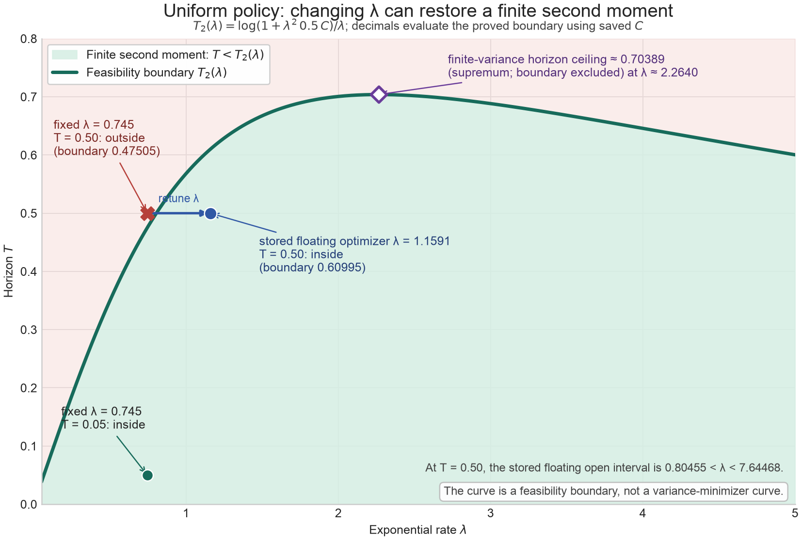

# 延长时间后：原 λ 如何失效，重新选 λ 能救到哪里

2026-10-05 用户认可范围。这里固定原始 derivative-coded Allen–Cahn
估计器、终值 `φ=1/2` 和均匀分支概率 `p=1/2`，只整理旧 λ 的失效与重新选 λ。
后续分支概率优化、改变表示的新算法及其进一步理论留在
`research/branching-mc-theory`，不随本次 main 整合引入。

## 结论

短时间的首项公式给出 `λ≈0.75`，此前使用的数值候选约为 `0.745`。
时间变长后，它先变得不够优，再离开有限方差区域。这个失效是**完整树的
二阶矩变成无穷大**，不等于每棵树都会无限分支，也不等于 PDE 解爆炸。

令

\[
P(v)=\frac9{64}+\frac v{16}+\frac92v^2+6v^3,
\qquad C=\int_0^\infty\frac{dv}{P(v)}\approx1.5301212285131.
\]

此估计器的完整树二阶矩有限，当且仅当

\[
T<T_2(\lambda),\qquad
T_2(\lambda)=\frac{\log(1+\lambda^2 C/2)}{\lambda}.
\]

边界不包含在有限区域内。对 `λ=0.745`，边界为 `T≈0.4750477`。
因此 `T=0.5` 时原 λ 的方差已经无穷大；重新选 λ 可以回到有限区域：

\[
0.8045463<\lambda<7.6446765\qquad(T=0.5).
\]

以上十进制为理论边界的数值计算，不是精确有理端点。λ 太小会使罕见分支的
逆概率权重过大；λ 太大也会放大完整树二阶矩。不能只把 λ 单向增大。

## 为什么边界能由理论求出

非负完整树矩递推给出最小非负矩系统。在这个平坦例子中，消去三角系统中的
辅助变量并使用积分因子，可化为

\[
v'(s)=\frac{e^{\lambda s}}{\lambda p}P(v(s)),\quad v(0)=0,
\qquad\Sigma(v)=\int_0^v\frac{dz}{P(z)},\quad p=\tfrac12.
\]

所以 `Σ(v(T))=(exp(λT)-1)/(λ²p)`；有限解存在恰好要求右侧小于 `C`。
这里还要检查根矩，而不能仅凭某个后代矩爆炸下结论。根二阶矩满足

\[
M_T(\lambda)=e^{\lambda T}\left[\frac14+
p\int_0^{v(T)}\frac{dz}{1+\lambda^2p\Sigma(z)}\right].
\]

当 `v(T)→∞`，被积函数趋于正数 `1/(1+λ²pC)`，故根矩也发散。
在边界及以后，非负递推的单调性给出无穷大。有限区域内一阶矩识别为同一个
PDE 解，故最小化二阶矩等价于最小化方差。

## 重新选择 λ 的实际结果

以下摘自冻结记录；“最优”是完整矩 ODE 的浮点数值优化结果，尚不是精确
全局最优值的有理证书。此表并非 Monte Carlo 样本方差，也非有限深度近似。

| T | 固定 λ=0.745 的方差 | 重新优化的 λ | 重新优化后的方差 |
|---|---:|---:|---:|
| 0.05 | 0.0001511595 | 0.7436702 | 0.0001511276 |
| 0.10 | 0.0008655286 | 0.7473188 | 0.0008653145 |
| 0.25 | 0.01324657 | 0.8211890 | 0.01230648 |
| 0.50 | ∞ | 1.1591179 | 0.14364119 |
| 0.65 | ∞ | 1.6688872 | 0.58206562 |
| 0.70 | ∞ | 2.2070993 | 1.77889674 |

即使每个 T 都重新选 λ，固定均匀分支概率下也只能到
`supλ T₂(λ)≈0.70388997`，且上界不能取到。此数值只约束这里指定的估计器和
采样族，不能宣称所有 PDE 算法都受这个上限限制。

## 如何复查，哪些还没有被证明

- [原始数值记录](lambda-horizon-evidence/raw-results.json)与
  [历史边界证书](lambda-horizon-evidence/boundary-certificates.json)
  按原字节保存；[manifest](lambda-horizon-evidence/manifest.json)记录来源和 SHA-256。
  完整归档包含其他分支概率和后续诊断，那些字段仅保留来源，不扩大本次认可范围。
- [作图脚本](lambda-horizon-evidence/plot_lambda_boundary.py)读取保存的均匀分支
  行并计算理论曲线；没有重跑 Monte Carlo。依赖 numpy、matplotlib，
  从仓库根目录运行 `python docs/research/results/lambda-horizon-evidence/plot_lambda_boundary.py`。
- `python demo/rate_variance.py --T 0.5` 可改变探索性 demo 的时间；
  demo 中的有限深度曲线和有限样本误差棒**不能诊断或证明无穷方差**。
  上面的完整树边界与保存的 ODE 结果才是本页的证据。
- 本次整合不增加 Lean 定理，不把分析推导、浮点 ODE 或画图包装成端到端形式化证明。
  原有 [Lean 覆盖说明](../../../formal/README.md)保持原范围。
- 含 T 的一般最优性方程、更一般 PDE 的安全条件和进一步算法，需另行讲解、
  审查与认可后再整合；不能从此例直接推断。

## 整合来源

以远端 main `629ed59c224216c1104c06d81d625054cf1ad0fe` 为基线，选择
`d1d2f6b1435c7b957cde839a17bffa8078698a95` 的时间参数及诊断作图改动，
并从 `327b582` 的长时间研究归档按路径提取两份 JSON；完整来源提交由 manifest
给出。本页是 2026-10-05 的解释性补充，不改写冻结记录。保留原研究历史及
未提交草稿，不整体合并混合研究提交，不强制推送。

本次验证：隔离工作树中的 `test_rate_variance.py`、`test_rate_optimization.py`、
`test_sampling_tuning.py` 共 49 项通过；使用 `/opt/miniconda3/envs/parabolab/bin/python`，
`PYTHONPATH` 指向该工作树。保存的 JSON 与来源提交逐字节核对，作图经过目视检查。
这不是新一轮 Monte Carlo 实验或 Lean 构建。
