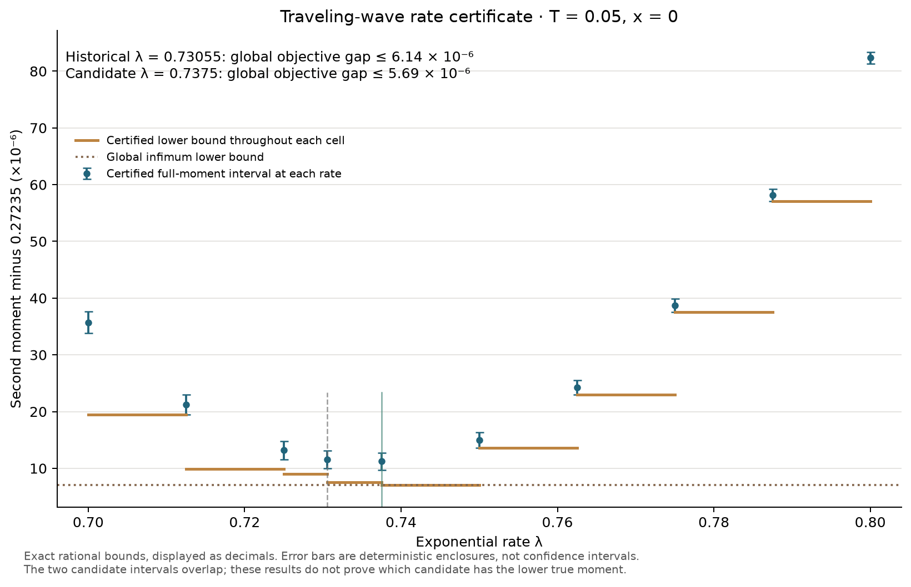

# Verified full-tree rate certificate for the Allen–Cahn wave

14 September 2026. Research branch `codex/research-certified-rate`, based on
`0afcb3c4ba446d20ff9337e4a4e1f2124bda5730`.

Integration update, 16 September 2026: the result is included in local
`main`, with user authorization confirmed. See the
[integration record](integration-2026-09-16.md). Numerical evidence below
retains its original run provenance.

**The historical rounded rate `λ=0.73055` now has a verified global
full-tree variance-excess bound below `6.130773×10^-6`.** Among ten
certified candidate points, `λ=0.7375` has the smallest certified upper
bound and a variance-excess bound below `5.688312×10^-6`. The same additive
bounds apply to second moments; the mean-identification proof below makes
the two objective gaps equal.

The result is for the existing one-dimensional Allen–Cahn traveling wave,
`T=1/20`, root `(t,x)=(0,0)`, raw `SemilinearMechanism`, uniform labelled
tuple probabilities and the ideal real-arithmetic estimator. The comparison
infimum ranges over **all positive rates**. It is not a claim about every
spatial state, every horizon, nonuniform proposals, or the precise distance
to a minimizing rate. The two candidate intervals overlap, so this certificate
does not prove that `0.7375` has a smaller true second moment than `0.73055`.
The historical rate here is exactly `14611/20000`; the earlier selector's
unrounded floating-point output was `0.7305486297108235`.

## What is certified

Let `M(λ)=E_λ[H²]` for the stated full-tree estimator. Exact rational
arithmetic verifies:

\[
M(59/80)-\inf_{\lambda>0}M(\lambda)
<5.688312\times10^{-6},
\]

\[
M(14611/20000)-\inf_{\lambda>0}M(\lambda)
<6.130773\times10^{-6}.
\]

The unrounded rational gap values are in the
[summary](wave-certificate/summary.json); their decimal displays are
approximately `5.6883117983770254e-6` and `6.130772565087558e-6`.
The selected-point upper bound is approximately `0.272362702676185` and
the verified global lower bound approximately `0.272357014364386`.
No attained global minimizer is assumed.

The exact rate-one enclosure is approximately
`[0.273317795882333, 0.273318563991140]`. Subtracting the selected upper
bound from its lower endpoint gives the exact positive rational quantity

`19219655807337406984112530419453 / 20123330041090706663014400000000000`,

which exceeds `0.000955093206`.
This is a certified additive **second-moment** reduction against rate one.
It is also a certified additive variance reduction for this benchmark:
the [mean-identification proof](../estimator-integrity/allen-cahn-mean-identification.md)
discharges the common-mean condition. This is a conventional stochastic
proof, not a new Lean formalization. No certified relative
variance percentage is asserted from the displayed floating-point mean.

The proof uses one verified all-six-code second-moment envelope at a
reference rate. The absolute first-moment recursion cancels the lifetime
rate and tuple probabilities, so it establishes bounded absolute first
moments for every positive rate. The signed six-field mild system is also
rate-free; bounded uniqueness identifies it with the explicit wave/PDE
fields. Thus the mean is the same at all positive rates, including those
with infinite second moments. Subtracting that common squared mean
preserves the global additive objective gap exactly, without numerically
evaluating the mean. This conclusion is scoped to the saved raw uniform
flat/wave estimators and their verified horizon.

## How the full-tree numerical error is bounded

The [derivation](../estimator-integrity/wave-numerical-certification-route.md)
uses the exact coordinate `s=1/(1+exp(x))`, so `x=0` is `s=1/2` and the
whole real spatial line is represented by the compact interval `(0,1)`.
The endpoints are the exact absorbing limits of the transformed diffusion;
this is not a spatial-tail truncation. In these coordinates all six
terminal squared code factors are polynomials.

A degree-five polynomial in normalized time approximates the six-code
moment equation. Its complete residual, including every high-order
coefficient, is constructed using exact rational polynomial operations.
The `1/T` factor in the time derivative is retained. Exact Bernstein
coefficient enclosures bound both the trial magnitude and the residual
on the entire time/state domain. `spatial_splits=2` means two successive
bisections, hence **four spatial subintervals**, not two sample locations.

An independently verified moment box bounds the true moments. The error
argument uses a signed box enlarged to include the absolute trial
magnitudes; it does not assume a trial polynomial is nonnegative. The
Jacobian bound yields a positive linear error system, whose 100 rational
upper steps are checked on a `2^-60` rounding grid. The resulting error
bounds enclose the **full moment directly**. They do not rely on convergence
of an infinite Taylor series or on agreement between quadrature resolutions,
and no separate killed-depth tail is added to these point certificates.

The arithmetic verifier recomputes residual/magnitude bounds and step
inequalities from the saved polynomial and witnesses; it does not trust
Taylor generation, a stored success flag, or a small floating residual.

## All ten certified rate points

The following endpoints are decimal displays of exact rational intervals;
use [the saved fractions](wave-certificate/summary.json) for arithmetic
claims rather than treating rounded displayed decimals as new bounds.

| Exact rate | Decimal rate | Moment lower endpoint ≈ | Moment upper endpoint ≈ | Absolute root-error bound ≈ |
|---|---:|---:|---:|---:|
| 7/10 | 0.70000 | 0.272383791096 | 0.272387635862 | 1.922e-06 |
| 57/80 | 0.71250 | 0.272369499083 | 0.272373016186 | 1.759e-06 |
| 29/40 | 0.72500 | 0.272361588838 | 0.272364815926 | 1.614e-06 |
| 14611/20000 | 0.73055 | 0.272360036682 | 0.272363145137 | 1.554e-06 |
| 59/80 | 0.73750 | 0.272359734758 | 0.272362702676 | 1.484e-06 |
| 3/4 | 0.75000 | 0.272363632400 | 0.272366368109 | 1.368e-06 |
| 61/80 | 0.76250 | 0.272372997754 | 0.272375524871 | 1.264e-06 |
| 31/40 | 0.77500 | 0.272387565549 | 0.272389904819 | 1.170e-06 |
| 63/80 | 0.78750 | 0.272407087733 | 0.272409257437 | 1.085e-06 |
| 4/5 | 0.80000 | 0.272431332103 | 0.272433348395 | 1.008e-06 |

For each interval between consecutive sampled rates, the verifier constructs
valid affine lower bounds by **extrapolating neighboring secants outside
their own defining pair**. A convex chord inside its defining interval is
an upper bound and is never used as a lower bound. Each cell's lower
envelope is minimized using exact rational endpoints and line intersections.

The first endpoint secant has a certified negative orientation and the
last a certified positive orientation. They yield lower bounds of
approximately `0.272383791095501` below rate `0.7` and
`0.272431332102570` above rate `0.8`. Both exceed the incumbent upper
bound, excluding improvements outside the sampled interval.

This extension uses convexity of the nonnegative topology representation.
An infinite exterior moment automatically satisfies a finite lower bound;
when an exterior moment is finite, the usual finite convexity argument
applies on the required points. Thus the global certificate does not assert
that every positive rate has a finite moment.



The error bars are deterministic moment enclosures, not statistical
confidence intervals. Cell bounds and the global lower bound are distinct
from the point intervals.

## Independent numerical and formal checks

The saved witness archive is
[wave-certificate/witnesses.json.gz](wave-certificate/witnesses.json.gz), with
SHA-256 `c1956d6418580a659f62c73e37b7fdad17f08260293fd718920d54d2ca288b51`.
The recorded exact verification result is `all_witnesses_valid: true`.
During documentation review, its digest, all ten exact point intervals,
selected point, global lower/gap, rounded-historical gap and exterior
exclusion were independently recomputed from the archived fractions.

Separate Chebyshev-collocation calculations assembled the reaction terms
from the actual sampler tuples. At orders 24 and 36, their second moments
agreed to about `10^-14` and lay inside the rational intervals for
`0.7375`, `0.73055` and `1`. This is useful independent numerical evidence,
but resolution agreement is not the source of the rigorous error bound.
The initial recorded generation/checking/diagnostic run took about `29.86 s`; that
number includes optional diagnostics and is not a production tuning-only
timing.

The existing eleven Lean algebra/order theorems remain separate from the
stochastic and analytic proof. The new
[ConvexEnclosure module](../../../formal/EstimatorIntegrity/ConvexEnclosure.lean)
adds five public lemmas: `convexEnclosure_right`, `convexEnclosure_left`,
`convexEnclosure_right_exterior`, `convexEnclosure_left_exterior` and
`convexEnclosure_cell_lower_envelope`, plus two private algebraic helpers.
The full `lake build` completed 3,390 jobs without warnings. Each public
theorem's axiom audit listed only `propext`, `Classical.choice` and
`Quot.sound`, transitively covering the helpers. The Python suite at this checkpoint
passed 226 tests with 14 slow tests deselected.

The formal statements assume convexity and valid finite real endpoint
bounds. They prove ray extrapolation, exterior constants and the pointwise
cell lower envelope. They do not prove the envelope-minimization algorithm,
Brownian semigroup facts, residual-to-moment comparison, Bernstein program
correctness, extended-valued stochastic convexity or the concrete rational
certificate.

## Practical meaning and remaining work

The approximate sweet spot is now backed by a quantified full-tree
objective guarantee at the specified wave root. This resolves the missing
numerical-error link for this instance by validating the full moment
system, rather than certifying the older recursive quadrature implementation.
The original finite-depth optimizer's generic convergence flag still is
not a certificate.

The [earlier replicated cost study](rate-cost-results.md) remains a
separate result: deterministic low-depth tuning did not demonstrate an
end-to-end improvement for its small one-profile budget, and the cheap
short-time rate `0.75` was the strongest observed baseline in that budget
phase. That study did not evaluate this new residual certificate's
construction cost or the `0.7375` candidate. No new practical speedup is
established by obtaining a mathematical guarantee.

The proposed shared-grid and one/ten-request reuse follow-up was subsequently
completed in the [profile checkpoint](profile-efficiency-checkpoint.md).
Separate root-dependent rates and continuation-aware proposals remain
optional algorithmic extensions; runtime is supporting evidence. Nonuniform
proposal certificates, other horizons/states, production roundoff,
uncertainty under heavy tails, alternate lifetimes/representations,
long-horizon extensions and high-dimensional transfer remain open parts
of the [research plan](../future-directions-after-lambda.md). This certificate
completes one milestone in that staged plan; the ten directions are
alternatives, rather than ten projects to complete simultaneously.

## Reproduction

Run from the repository root in the existing `parabolab` environment:

```sh
/opt/miniconda3/envs/parabolab/bin/python examples/certified_wave_rate.py --verify docs/research/results/wave-certificate/witnesses.json.gz
```

To generate a separate run without replacing these artifacts:

```sh
/opt/miniconda3/envs/parabolab/bin/python examples/certified_wave_rate.py --degree 5 --spatial-splits 2 --output /tmp/parabolab-wave-certificate-reproduction
```

[Implementation](../../../parabolab/wave_certificate.py),
[driver](../../../examples/certified_wave_rate.py),
[theory](../estimator-integrity/wave-numerical-certification-route.md),
[exact summary](wave-certificate/summary.json), and
[research checkpoint](certified-rate-checkpoint.md).
