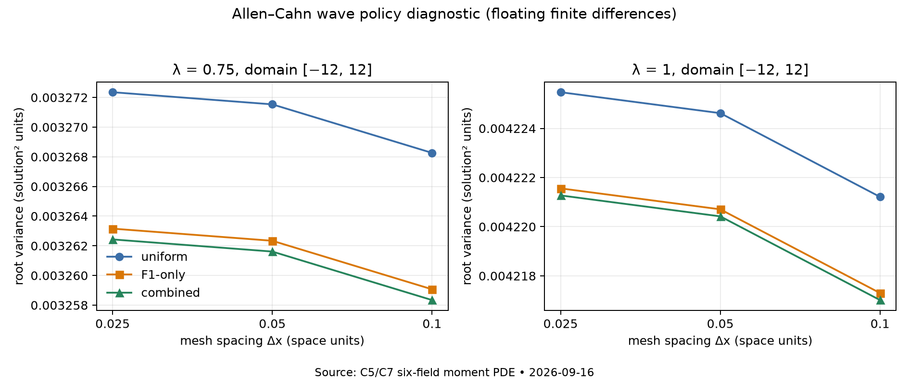

# Numerical evidence and scope

All tests use the actual raw 1D semilinear Allen–Cahn mechanism and the explicitly stated tuple law. No Monte Carlo speedup, statistical confidence interval or jointly optimal sampler is claimed.

## Exact nonuniform moment certificates

The original [protocol](numerics/protocol.json) fixes phi=1/2, T=.05,.2,.5, lambda=.75,1, 200/400 time steps and 60-bit outward dyadic rounding. The [wave amendment](numerics/protocol-amendment-wave-q1.json) was written before evaluating the newly derived nonzero F1 policy. See [results](numerics/results.json), [witness archive](numerics/witnesses.json.gz) and [verification](numerics/verifier.json).

Of 52 attempted certificates, **38 verify and 14 are inconclusive**: 22 successful flat enclosures and 16 wave envelopes. All 38 serialized witnesses passed a separate archive recheck. Eleven successful independent SciPy flat ODE references lie inside their corresponding two-sided intervals; the uniform T=.5/lambda=.75 ODE reference also failed and was initially recorded as inconclusive.

At 400 steps, the rigorously positive root variance-decrease lower bounds for the flat q=(.95,.95,.95) policy versus uniform are:

| T | lambda | Absolute decrease at least | Relative decrease at least |
|---|---|---|---|
| .05 | .75 | 0.0000444008 | 28.89% |
| .05 | 1 | 0.0000193877 | 1.86% |
| .2 | .75 | 0.00300631 | 47.13% |
| .2 | 1 | 0.00128977 | 13.35% |
| .5 | 1 | 0.0928835 | **53.42%** |

Decimals in this table are rounded conservatively; exact fractions are in [variance-bounds.json](numerics/variance-bounds.json). This post-analysis rechecks all 22 flat witnesses and encloses the common mean square using an exact degree-30 positive exponential Taylor sum with a geometric remainder. It bounds the fractional decrease by `(baseline moment lower − candidate moment upper)/(baseline moment upper − mean-square lower)`; neither a floating mean nor a sampled variance enters those guarantees. The candidate already coincides with the existing terminal proxy at floor_mass=.1 for these flat data.

Final recorded certificate construction took 7.188 seconds; direct exact checking 0.756 seconds; archive rechecking 1.287 seconds; floating ODE references 0.490 seconds on this machine. These are setup/verification costs, not sampler runtime savings or calibrated cross-hardware comparisons. See JSON for exact recorded timing and source/environment hashes.

The 14 failed box searches remain in the archive. A separate C8 theorem now classifies the **two flat uniform T=.5/lambda=.75 attempts** as lying beyond the actual moment-explosion threshold. The other 12 wave-envelope failures remain inconclusive; they do not prove wave divergence.

## Exact wave acceptance gate

`wave_gate_check.py` uses verified 100-step uniform all-code wave envelopes at T=.05. Exact arithmetic gives the global F1 contribution-ratio lower bounds:

- lambda=.75: `216186910784669/87960930222080`, approximately 2.4577606244.
- lambda=1: `30898504436641/10995116277760`, approximately 2.8102026078.

Both exceed 2, certifying q_F1(first)=2/3. The conventional positivity argument upgrades this to strict Id-root variance reduction for every finite x and every positive remaining time through T. Both generation and standalone verification passed; altered ratios and altered/rehashed endpoints were rejected. The full baseline witnesses and digests are embedded in [wave-gate-checks.json](wave-gate-checks.json).

The newly generated wave envelopes also verify for q=(1/2,2/3,19/20). Their endpoint differences measure **upper-bound changes**, not the magnitude of root variance reduction.

## Independent floating wave calculation

The [frozen finite-difference protocol](wave-diagnostic-protocol.json) uses the six-field moment PDE on [-12,12], mesh sizes .1,.05,.025, and a [-16,16] check at mesh .05. Classical RK4 uses dt<=.2 dx². Homogeneous-limit boundary data are an approximation. G_q is implemented independently of the certificate module.

At x=0,T=.05 on the finest grid:

| lambda | Uniform variance | F1-only fractional decrease | Combined fractional decrease |
|---|---|---|---|
| .75 | 0.00327235338 | 0.2810% | 0.3032% |
| 1 | 0.00422547195 | 0.09259% | 0.09937% |

These are **floating diagnostics**, not rigorous percentage bounds. Mesh differences contracted by approximately .25024, consistent with second-order spatial convergence; domain sensitivity was at roundoff scale. Neither check supplies a certified truncation-error bound. All 24 rows, source hashes, runtimes and error checks are retained in [wave-diagnostic-results.json](wave-diagnostic-results.json). The first absolute F3-error threshold was too strict; the recorded analysis switched to a 1e-8 relative tolerance, with maximum observed relative error 9.02e-10. No solver, mesh or protocol parameters were tuned to improve the policy effect. This threshold adjustment is retained explicitly, not counted as a pristine first-pass check.



## Exact explosion-time check

The [C8 protocol](numerics/flat-explosion-protocol.json) was frozen after deriving the scalar reduction, separately from the failed-box experiment. On [0,8], 65,536 monotone rectangles with each reciprocal outward-rounded to 2^-60, plus analytic cubic-tail bounds, give

`1.5296515572795701 <= C <= 1.5306314105900025` (display approximations; exact fractions in the archive).

Exact exponential comparisons establish:

| Common first-label p | lambda | Proven bracket for explosion time | At T=.5 |
|---|---|---|---|
| 1/2 | .75 | (.477,.478) | Infinite second moment |
| 1/2 | 1 | (.568,.569) | Finite second moment |
| 19/20 | .75 | (.796,.797) | Finite second moment |
| 19/20 | 1 | (.897,.898) | Finite second moment |

An independent researcher used a separate 8,192-cell rational calculation and obtained the same finite/divergent separation. The primary verifier regenerates the finite sums and comparisons; generation with internal verification took about 6.2 seconds, and a separate `--verify` took 2.89 seconds. An altered C endpoint was rejected. Floating quadrature gives C≈1.5301212285131 and thresholds .4772224/.5681850/.7967322/.8975625; these numbers corroborate rather than determine classifications. [Exact result](numerics/flat-explosion-checks.json).

## Executed commands and regressions

Executed from the repository root, using `/opt/miniconda3/envs/parabolab/bin/python` unless otherwise shown:

```sh
python examples/certified_tuple_policy.py
python examples/certified_tuple_policy.py --verify docs/research/runs/2026-09-16-certified-tuple-policy/numerics/witnesses.json.gz
python docs/research/runs/2026-09-16-certified-tuple-policy/numerics/derive_variance_bounds.py
python3 docs/research/runs/2026-09-16-certified-tuple-policy/wave_gate_check.py
python3 docs/research/runs/2026-09-16-certified-tuple-policy/wave_gate_check.py --verify
python docs/research/runs/2026-09-16-certified-tuple-policy/check_theory.py
python docs/research/runs/2026-09-16-certified-tuple-policy/wave_moment_diagnostic.py
python docs/research/runs/2026-09-16-certified-tuple-policy/numerics/flat_explosion_check.py
python docs/research/runs/2026-09-16-certified-tuple-policy/numerics/flat_explosion_check.py --verify docs/research/runs/2026-09-16-certified-tuple-policy/numerics/flat-explosion-checks.json
python -m pytest -q
```

Exact environment variables/commands are recorded in individual metadata. The root integration test completed **263 passed, 14 slow tests deselected** in 60.05 seconds; [log](python-tests.log). New focused tests check uniform closure, signed interval endpoints, raw-label/scalar correspondence, actual sampler inverse weights, callback support at floating boundaries, exact witness tampering and independent ODE containment. Theory stress checks cover 1,962 exact binary cases and 1,000 floating finite likelihood-kernel convexity trials; they are not proofs of the infinite stochastic statements.

The five Lean declarations, module/import build and axiom audit are recorded separately in [06-formalization.md](06-formalization.md). Monetary cost/token totals were not available and are not estimated.
