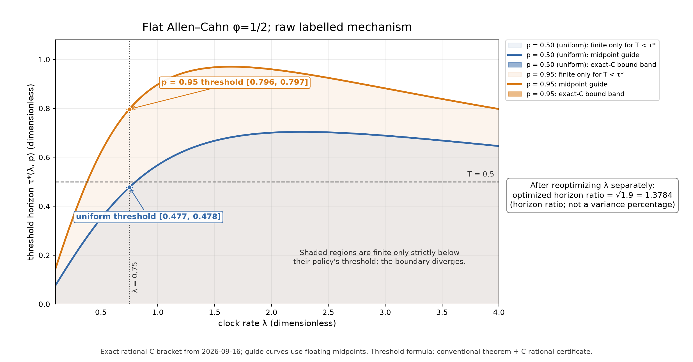

# Tuple selection can move the finite-variance boundary

The strongest outcome of this continuation is an **exact second-moment explosion law for the raw flat Allen–Cahn estimator**, together with a separately certified improvement for the nonconstant wave. The result goes beyond finding another approximate lambda: it shows how tuple probabilities change the time horizon on which a finite-variance estimator is possible. This is a new result in the current project, with bounded literature review; publication novelty remains unestablished.

## What's the gap?

Your existing work certifies scalar rate selection for fixed uniform tuples and supplies a terminal-data proposal heuristic. Changing q also changes every descendant's moment. A local square-root optimum with frozen continuations does not resolve that dependence, and a positive support floor alone does not guarantee lower variance.

The practical question was whether a tuple change can be justified for the **whole unrestricted tree**, and whether it changes the usable regime rather than merely improving a small-sample plot.

## What did this run establish?

**1. An exact flat-data threshold.** For flat terminal value phi=1/2, let p be the first-label probability for F0,F1,F2; the second labels retain probability 1-p, and F3 remains unchanged. At a common exponential rate lambda,

\[
T_*(\lambda,p)=\frac{\log(1+\lambda^2pC)}{\lambda},\qquad
C=\int_0^\infty\frac{dv}{9/64+v/16+(9/2)v^2+6v^3}.
\]

The full Id-root second moment is finite exactly for **T<T_***; it diverges at the boundary. The result includes a proof of root divergence, not only divergence of a derivative-code bound. An exact rational calculation encloses the one fixed constant C; no unknown continuation moment remains inside the formula. [C8 proof](04-theory.md), [independent review](09-independent-review.md), [exact calculation](numerics/flat-explosion-checks.json).

At lambda=.75, the uniform p=.5 threshold lies strictly between .477 and .478. For p=.95 it lies between .796 and .797. Therefore at **T=.5**, the uniform estimator has **infinite variance**, whereas the supported p=.95 estimator has **finite variance and the same PDE mean**. The earlier numerical failure at this setting is now explained by an independent theorem and exact bounds; the failed solver itself was not used as proof.

The improvement also survives rate optimization. Maximizing T_* over lambda separately for each p gives a threshold proportional to sqrt(p). Hence moving from p=.5 to .95 increases the best achievable horizon threshold by exactly

\[
\sqrt{19/10}-1\approx\mathbf{37.84\%}.
\]

This is a horizon-threshold increase, not a variance percentage or a runtime speedup. The horizon-maximizing rate differs from a variance-minimizing rate at a prescribed T. The boundary remains excluded.

**2. A quantified finite-variance comparison.** At flat phi=.5, T=.5 and lambda=1, both estimators have finite variance. Exact rational moment and mean-square bounds prove that p=.95 reduces variance by **at least 53.42%** relative to uniform tuples. All other jointly certified flat settings also improve; the full matrix is retained. The flat p=.95 policy coincides with the existing terminal proxy at floor_mass=.1, so the new contribution is its proof and certification, not an invented sampling rule. [C5/C6 evidence](numerics/variance-bounds.json).

**3. A safe change between genuinely nonzero wave branches.** For the traveling wave at T=.05, lambda=.75 or 1, set the first-label probabilities to `(1/2,2/3,19/20)`. A continuation-moment comparison proves a **strict full-tree variance decrease at every finite starting position** and every positive remaining time through T. Both F1 alternatives are nonzero; this part is not just reallocating mass away from dead branches. The F1-only change `(1/2,2/3,1/2)` is also strictly beneficial. [C7](04-theory.md), [exact acceptance witnesses](wave-gate-checks.json).

The gain is modest at the wave center: independent floating moment-PDE calculations estimate approximately **0.303%** for the combined policy at lambda=.75 and **0.0994%** at lambda=1. Mesh refinement supports these estimates, but the percentages are not rigorously enclosed. The strict-decrease theorem is stronger evidence of the sign; the floating calculation estimates the size. No comparison against the terminal proxy or globally optimal q is claimed. [Diagnostic](wave-diagnostic-results.json).

## How did the derivation work?

Two ideas handle different parts of the problem.

For general tuple updates, start with the old **full** moment field M_q. If the new local tuple objective evaluated at that field is no larger at every reachable decision, then M_q is an upper solution for the new recursive moment operator. Starting the new operator from zero and iterating gives the actual new descendants and proves M_new<=M_q. Nothing freezes their final moments. A sign-aware interval test makes the local acceptance condition computable whenever certified continuation intervals are available.

For the wave, structural inequalities between code moments provide those comparisons globally. In particular the F1 first contribution is at least R times its second contribution, with certified lower bounds R>2.4577 and R>2.8102 at the two tested rates. Since R>2, choosing the first label with probability 2/3 safely improves the conditional objective. Positivity propagates the strict decrease from F1 through F0 to Id. The implementation's tuple callback runs before the Brownian branch position is sampled, so the proof explicitly averages the child-product inequality over that shared position.

For flat data, derivative subtrees vanish and the remaining positive moment system has a triangular structure. Remove its common exp(lambda*T) factor, change time to `(exp(lambda*T)-1)/lambda²`, then introduce an accumulated variable s. The recursive system reduces to

\[
\frac{ds}{d\theta}=a_0+(b_0/p_0)s+
\frac{c_0s^2}{2p_0p_1}+\frac{e_0s^3}{6p_0p_1p_2}.
\]

The time needed for s to reach infinity is the integral of the reciprocal cubic. With all p_k=p, the substitution s=pv pulls out exactly p, producing the displayed threshold. The root moment is a further positive integral that diverges at the same time. This retains the full recursive moment dependence while reducing its analysis to one computable scalar integral.

A supporting theorem also establishes joint log-convexity of full-tree second moments in the common rate and static probabilities by integrating whole-tree likelihood kernels. It supplies useful structure for a future joint optimizer; no validated joint optimizer was implemented here. [C1–C4](04-theory.md).

## What was checked, and what remains outside the checks?

- **Numerics:** 38 exact nonuniform witnesses verified; 14 failed searches retained. C8 explains the two failed flat baseline attempts; the other 12 wave failures remain inconclusive. Two exact wave acceptance witnesses, exact flat variance bounds and the exact scalar threshold calculation passed. An independent researcher used a different rational mesh to confirm the finite/infinite separation.
- **Regression:** 263 Python tests passed; 14 slow tests were deselected. New tests include the actual sampler's inverse-probability weight and rejection of corrupted witnesses.
- **Lean:** five algebra/order lemmas built through the full 3,392-job library, with only standard logical axioms. They cover the binary gate and monotone iteration step. **The scalar explosion theorem, wave semigroup argument and certificate programs are not Lean-formalized.** They have conventional proofs and independent review. [Formal scope](06-formalization.md).
- **Cost/uncertainty:** rational construction and checks take seconds for this matrix; timing is recorded, but no sampling-speed claim is made. Wave magnitudes have unvalidated spatial/time/discretization error. A recorded F3 diagnostic tolerance adjustment is disclosed in the numerical report. Exact rational policies and floating sampler probabilities also have separate roundoff scopes. [Complete numerical record](05-numerics.md).

Convex importance sampling and ODE/supersolution moment bounds have substantial precedent: [Ryu–Boyd](https://stanford.edu/~boyd/papers/pdf/adaMC.pdf), [Henry-Labordère et al.](https://arxiv.org/abs/1603.01727), and [Awad–Glynn–Rubinstein](https://web.stanford.edu/~glynn/papers/2013/AwadGRubinstein13.pdf). The plausible contribution is the explicit derivative-coded policy-safety framework, its nonzero wave application, and the exact raw-flat threshold/certification. A bounded search does not establish historical priority.

The revised score for the continued direction is 10×10×100=10000: the effect score reflects an actual infinite-to-finite variance transition in the specified benchmark, while novelty remains a scoped extension. Initial scores and all ten alternatives are preserved alongside the post-result reassessment.

The next substantive step is to obtain a **large, certified improvement on nonconstant data** using continuation bounds, at the same rate and against the existing terminal proxy. The current wave proof establishes safety, but its measured short-horizon effect is small. [Actionable continuation](08-next.md).
