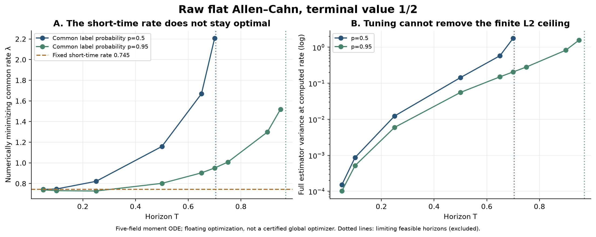
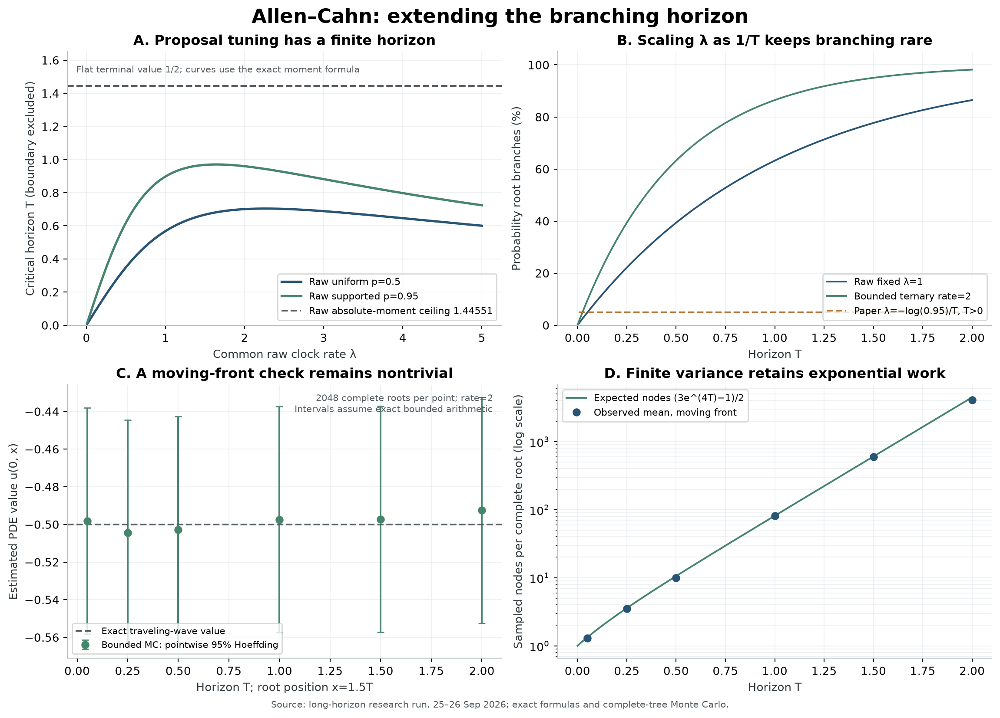

# 把时间拉长后，Lambda 选择会怎样？

本轮已按「检索方向 → 评估 → 理论 → Lean → 代码与实验」完成。研究日期为
2026 年 9 月 25–26 日，沿用项目中的 Allen–Cahn 方程及原始 derivative-coded
branching estimator。

结论是：**短时间选出的 Λ 不能直接沿用到长时间；在原始表示中，即便继续优化
Λ，也会碰到有限的矩上限。更长时间需要考虑改变表示或分段延拓，同时控制计算成本。**
本次已把一个有明确文献来源的有界表示接入项目，并在非恒定行波上数值检验到 $T=2$。
这时绝大部分根节点都会分支，已经覆盖了原先「几乎直接走到 terminal condition」
之外的情形。

## 1. 检索与选择

检索比较了 9 组原始文献，整理了 10 个方向：原始树绝对可积性边界、有界投票的
方差与成本、带误差认证的分段重启、code/time 自适应 hazard、非恒定数据的 tuple
策略、非指数等待时间、线性项重求和、残差控制变量、multilevel Picard，以及空间
相关的爆炸边界。逐项假设、障碍、首个验证实验及退出条件见
[方向评估](01-ideas.md)和[完整方向卡](ideas.json)。

保守评分中没有方向严格超过「高价值」门槛，本轮没有为凑出赢家而提高分数。
根据你明确提出的长时间问题，执行了最直接的 D01：确定原始树究竟哪里失效，
并用一个已知的长时间表示作对照。

文献已经有 [Allen–Cahn 的三叉多数投票表示](https://arxiv.org/abs/1607.07563)，
也有[局部多项式/Picard 的长时间方法](https://arxiv.org/abs/1612.06790)。
近期的 [coding-tree 稳定性研究](https://arxiv.org/abs/2502.17853)也讨论了矩与可积性。
因此本次有界算法应视为有出处的比较基线；本项目新增的重点是原始 flat 树的具体
边界推导、与现有代码的对应、形式化的确定性部分，以及长时间实验记录。
没有声称首次解决 Allen–Cahn 的长时间 branching 问题。

## 2. 原始算法：最优 Λ 随时间变化，但可行区间最终消失

先固定 terminal data φ=1/2，并保持原来的 raw coding-tree 表示。
令 p 为 F0/F1/F2 使用的共同第一类 tuple 概率。p=.5 是均匀策略，p=.95 是保持
正支持的固定策略。这不是联合最优化所有 code/time 策略。

以下 Λ 由**完整五维二阶矩 ODE**的浮点优化得到，未使用样本方差充当目标：

| T | p=.5 的计算最优 Λ | 对应完整方差 | p=.95 的计算最优 Λ | 对应完整方差 |
|---|---:|---:|---:|---:|
| .05 | .743670 | .000151 | .738953 | .000102 |
| .25 | .821189 | .012306 | .727572 | .005949 |
| .50 | 1.159118 | .143641 | .801875 | .055605 |
| .70 | 2.207099 | 1.778897 | .950620 | .206451 |
| .95 | 无有限二阶矩的共同 Λ | ∞ | 1.519624 | 1.580689 |
| 1.00 | 无有限二阶矩的共同 Λ | ∞ | 无有限二阶矩的共同 Λ | ∞ |

这些小数是经容差加严复核的数值结果，不是经过区间认证的全局最优解。
特别地，原来短时间附近的 Λ≈.745，在 p=.5 时只允许


    T < 0.4750477…

所以到了 T=.5，它已经不是「稍微不够好」，而是完整二阶矩发散。重新调 Λ 可以
恢复这一时间点的有限方差，但改善有明确上限。

沿用并重新验证先前的二阶矩定理：

$$
T_2(\lambda,p)=\frac{\log(1+\lambda^2pC)}{\lambda},
\qquad C\approx1.53012123.
$$

有限二阶矩要求严格满足 $T<T_2$。对 Λ 优化后，p=.5 的极限时间约为
**.703890**，p=.95 约为 **.970245**。另有有理数证书分别证明它们小于
**.705** 和 **.972**；即便让 p 趋近 1，这个共同指数时钟家族的极限仍严格小于
**1**。使可行时间最长的 Λ，与给定较短 T 下使方差最小的 Λ，是两个不同问题。



## 3. 更强的理论限制：有些失败不是换 sampling policy 就能修复

对相同的 flat 原始树，把绝对值矩写成正的积分系统，proposal 的概率和密度与
重要性权重逐项抵消。令 $J=E|H_{Id}|=1/2+s$，得到精确标量方程

$$
s'=\frac38+\frac{s}{4}+\frac32s^2+s^3
   =(s+\tfrac32)(s^2+\tfrac14),\qquad s(0)=0.
$$

因此

$$
\boxed{T_{\mathrm{abs}}=\int_0^\infty\frac{ds}{(s+3/2)(s^2+1/4)}
       =\frac{3\pi-2\log3}{5}\approx1.44551068.}
$$

在相同 raw expansion、实际 reciprocal weights、正支持且树几乎必然完成的
假设下，**所有这类 importance proposal** 都具有同一个绝对可积性边界。
在边界及其之后 $E|H_{Id}|=\infty$，并且在边界之前也有

$$
E H_{Id}^2\ge (E|H_{Id}|)^2=(1/2+s(T))^2.
$$

这覆盖改变 Λ、某些非指数时钟以及依赖 code/time/history 的合法 proposal；
但只针对这里的 flat 原始树，不能外推成所有空间数据或所有 branching 表示的
不可能定理。把不同带符号树合并、消去或更换表示，会改变这个结论所针对的对象。

PDE 本身仍有全局有界解

$$
u(T)=[1+3e^{-2T}]^{-1/2}.
$$

因此这里失效的是原始随机表示的可积性。实际也看到：T=2 的 4096 个原始样本
全部是有限数，样本均值为 1.6944，而 PDE 真值为 .973609。
有限样本全部算完、样本方差有限，不能证明总体矩存在。
完整常规证明和独立复核分别见 [04-theory.md](04-theory.md) 与
[09-independent-theory-review.md](09-independent-theory-review.md)。

## 4. 延长 T 时，先确认分支真的变多

若一直采用论文中的

$$
\lambda=-\log(0.95)/T,
$$

那么根节点分支概率永远为 $1-e^{-\lambda T}=5\%$。因此，单独增加 T 并沿用
这个公式，不能实现你希望的「让 branching 的困难充分出现」。本轮保留该基线，
同时检查固定 Λ、重新优化 Λ，以及 rate=2 的三叉有界树。

原始非恒定行波的六维矩 PDE 也做了两层网格计算：12 个 rate/policy/mesh 配置
均在约 .383–.686 触发预定安全停止。72 个计划结果中，44 个到达指定时间，
28 个明确保留为未到达。可比较网格的最大根矩差约 $3.70\times10^{-5}$。
**这些停止只是数值诊断，尚未证明非恒定问题的爆炸时间。**

## 5. 一个可工作的长时间比较：有界多数投票

对任意值域在 [-1,1] 内的 terminal data，使用 rate $r\ge2$ 的完整三叉
Brownian 树。三个孩子共享父节点死亡时的位置，之后独立演化；叶子取 φ(X)，
内部节点聚合为

$$
B_r(a,b,c)=\frac{r+1}{3r}(a+b+c)-\frac{abc}{r}.
$$

因为

$$
B_r=\frac2r\frac{a+b+c-abc}{2}
 +(1-\tfrac2r)\frac{a+b+c}{3},
$$

每棵有限树的输出都在 [-1,1]。树在任意有限 T 几乎必然完成，并且

$$
r(B_r(u,u,u)-u)=u-u^3,
$$

由条件独立与 mild equation 的唯一性，均值对应相同 Allen–Cahn PDE。
在精确实数模型中，这个表示对任意有限 T 都有有限矩。
当前代码实现限于一维、标记为 Allen–Cahn 的 PDE；并未扩展为一般全非线性求解器。

本轮共运行 **60 组、122,880 棵完整根树**，包括 flat、固定空间点和移动行波前沿。
移动点取 $x=1.5T$，其真值一直为 -.5，可以避免仅在趋近稳态的位置获得容易的结果。

| T，rate=2 | 移动前沿估计，真值 -.5 | 根节点实际分支比例 | 每棵根树理论平均节点数 |
|---|---:|---:|---:|
| .05 | -.498158 | 8.69% | 1.33 |
| .50 | -.502716 | 63.38% | 10.58 |
| 1.00 | -.497475 | 87.50% | 81.40 |
| 1.50 | -.497277 | 95.21% | 604.64 |
| 2.00 | **-.492524** | **97.80%** | **4470.94** |

每组 2048 个样本；60 组最大实际均值误差为 .007476。
基于精确有界模型的单点 95% Hoeffding 半径为 .06002，60 组同时覆盖的半径
为 .08718，本次均覆盖对应真值。它们较保守，不能据此声称误差被认证在 .007476
以内。浮点运算误差没有纳入这些区间；归档中有 3 个值低于 -1 一个 ulp，已保留
且未 clipping。



代价仍然明显：总节点期望为

$$
E[N_T]=\frac{3e^{2rT}-1}{2}.
$$

所以 rate=2、T=2 已约需 4471 个节点/样本。更大的 r 在这个家族中会降低完整
方差，但提高工作量。例如 flat T=1 时，r 从 2 增加到 3，方差约从 .02577
降到 .01271，平均节点数却从 81.4 增加到 604.6。r=2 是该有界家族中期望
节点数最小的选择，没有证明它也是方差或方差乘成本的全局最优。

## 6. Lean 与代码交付范围

先完成常规理论与独立审核，再完成 Lean，之后才开始数值代码。
Lean 已验证 **11 个定理声明**：正多项式分解与正性、分式恒等式、分支反应恒等式、
rate 的角点必要条件、凸组合、区间保持，以及对任意有限三叉树的结构归纳。
两个模块及总入口均构建通过，axiom 审计只含标准公理，没有 sorry/admit。

随机树与 PDE 的对应、proposal 密度消去、ODE 爆炸与反常积分、方差单调性，
仍是常规数学证明；没有把这些冒充为已完成的 Lean 端到端验证。
详见 [形式化范围](06-formalization.md)和[代码对应审查](10-correspondence-review.md)。

新增求解器为 `AllenCahnMajorityMC`，兼容现有 Solver/Curve。最小用法：

```python
from parabolab import AllenCahnMajorityMC
from parabolab.library import allen_cahn_wave_1d

pde = allen_cahn_wave_1d(T=2.0)
curve = AllenCahnMajorityMC(
    n_samples=2048, rate=2.0, seed=20260925
).solve(pde, [-2.0, 0.0, 2.0, 3.0])
print(curve.values, curve.stderr, curve.note)
```

它完成所有开始的根树，没有深度截断、删掉大样本或裁剪输出。输入要求有限 T，
并依赖明确的 Allen–Cahn 标记及 φ 的全局有界契约；有限采样只能检查已观察的叶子。
最终默认 Python 测试为 **274 passed，14 deselected**。
全部原始样本、源文件哈希、命令、精度复核，以及修复过的失败检查均记录在
[数值复现说明](05-numerics.md)。开始前已有的三个 rate-variance 文件改动已保留。

## 7. 下一步应攻克什么

继续研究原始算法时，最直接的延伸是**非恒定数据下的边界认证**：需要能传递到
根节点的正 subsolution/supersolution，才能把这次的数值停止转化为定理。
code/time 自适应 sampling 值得在 raw 绝对可积性边界以内研究，目标应是有认证的
增益及成本比较。

若目标是实用的更长时间，则优先考虑**带 continuation 误差控制的分段方法**，
或对带符号树进行有理论依据的重求和。简单重启后复用带噪声的 continuation
并不自动保持无偏，导数和误差传播都需要单独处理。现在的有界求解器可作为
准确、强分支但成本可量化的基线。下一阶段的具体首个实验与失败条件见
[08-next.md](08-next.md)。
